# 踏出第一步

从零开始写一个页面，绝大多数情况下我们都需要一个代码样板来帮我们快速开始，避免重复的工作。这个样板至少会包括以下内容：

1. 设置 doctype
2. 设置页面编码
3. 引入初始化 css

作为一个前端开发者，你应该维护好一份适合自己的代码样板，使得日后自己的每个项目都可以以此来初始化。下面是一份我常用的样板：

```html
<!--
HTML5. Use tags like <article>, <section>, etc.
See: http://www.sitepoint.com/web-foundations/doctypes/
-->
<!doctype html>

<html lang="en">
  <head>
    <meta charset="utf-8">

    <!--
    Ask IE to behave like a modern browser
    See: https://www.modern.ie/en-us/performance/how-to-use-x-ua-compatible
    -->
    <meta http-equiv="x-ua-compatible" content="ie=edge">

    <title>My Site</title>

    <!--
    Disables zooming on mobile devices.
    -->
    <meta name="viewport" content="width=device-width,initial-scale=1">

    <!--
    Stylesheet that minimizes browser differences.
    See: http://necolas.github.io/normalize.css/
    -->
    <link rel="stylesheet" href="css/normalize.css">

    <!--
    Our own stylesheet.
    -->
    <link rel="stylesheet" href="css/main.css">
  </head>
  <body>
    put content here
  </body>
</html>
```

在这个简单的样板我们做了挺多事：

+ 指定使用 HTML5 语法
+ 要求 IE 遵守现代浏览器的渲染标准
+ 锁死页面在移动设备显示宽度
+ 引入了 [normalize.css](http://necolas.github.io/normalize.css), 在默认的HTML元素样式上提供了跨浏览器的高度一致性

> **提示**: 如果你之前在使用 reset.css 来完成同样的事情，请迁移到 normalize.css。关于他们之间的差异可以参考：
+ [英文：What is the difference between Normalize.css and Reset CSS](http://stackoverflow.com/questions/6887336/what-is-the-difference-between-normalize-css-and-reset-css)
+ [中文：来，让我们谈一谈 Normalize.css](http://jerryzou.com/posts/aboutNormalizeCss/)

请你克隆这个课程的样板：

```
git clone https://github.com/sikeio/css0to1-startkit.git
```

点击 `index.html` 打开页面。

# Live 页面编辑(可选项)

+ BrowserSync

每次做了修改还要自己手动刷新页面挺麻烦的。用 [BrowserSync](http://www.browsersync.io/) 可以省去这个麻烦。

安装 BrowserSync (依赖 NodeJS):

```
npm install browser-sync@2.7.1
```

然后在项目目录运行这个命令：

```
browser-sync start --server --port 4000 --files index.html --files css/main.css
```

这样页面就会自动刷新了。

我个人喜欢命令行工具。如果你安装不了 Node 工具，也可以尝试看看F5 Web 编辑器 。

+ [F5 Web 编辑器](http://getf5.com/)


# 设置固定背景

滚动页面时可以发现：

1. 页面的背景是固定的，不随页面的滚动而滚动
2. 同时放大和缩小窗口可以发现页面背景也会随之放大和缩小


首先我们就来实现这个固定背景。

MDN 和 Can I Use 这两个网站在前端开发中非常重要，在使用 CSS3 属性的时候一定要养成查阅的习惯, 确认你的目标浏览器有支持。

### CSS 样板 - 固定背景

背景固定有两种实现方式，一种是元素 fixed，其背景不做特殊处理；另一种是背景固定，元素不做特殊处理。

我们在这里使用第二种实现方式，在 `body` 元素中使背景固定。

[固定背景 Demo](demo/background-cover.html)

* HTML
```html
<body>
</body>
```

* CSS
```css
body {
    background-image: url(../img/bg5.jpg);
    background-attachment: fixed;
    background-size: cover;
    background-position: center;
}
```

实现原理：

+ `background-attachment: fixed;` 使背景图不随页面的滚动而滚动
  + [Can I Use: background-attachment](http://caniuse.com/#feat=background-attachment)
  + [MDN: background-attachment](https://developer.mozilla.org/zh-CN/docs/CSS/background-attachment)

* `background-size: cover;` 使背景图始终填满整个屏幕
  + [Can I Use: background-size](http://caniuse.com/#search=background-size)
  + [MDN: background-size](https://developer.mozilla.org/zh-CN/docs/Web/CSS/background-size)

+ `background-position: center;` 使背景图居中
  + [Can I Use: background-position](http://caniuse.com/#search=background-position)
  + [MDN: background-position](https://developer.mozilla.org/zh-CN/docs/CSS/background-position)

更多关于背景的知识: [Backgrounds In CSS: Everything You Need To Know](http://www.smashingmagazine.com/2009/09/02/backgrounds-in-css-everything-you-need-to-know/)

### 练习 - 固定背景

使用 `CSS3 固定背景` 技巧为你的主页加上背景图：

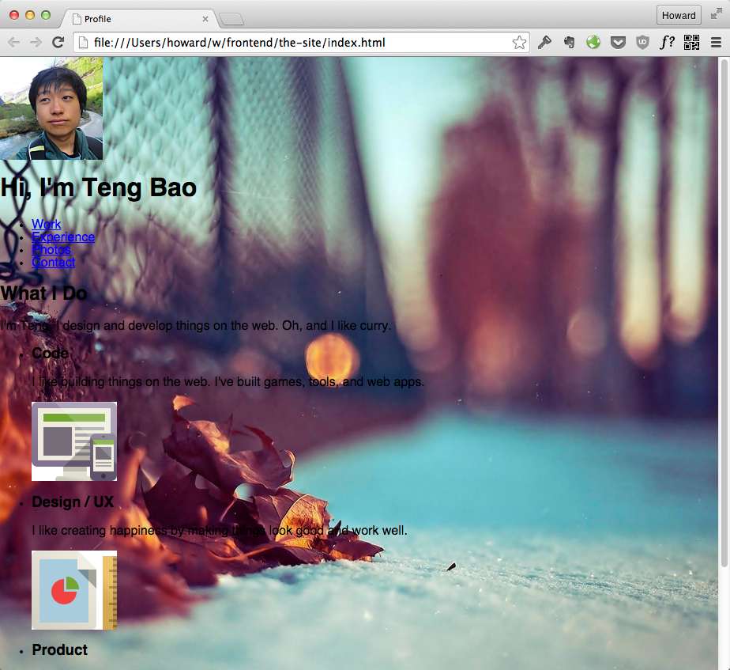

# 居中外包围框

我们接下来要为页面的内容加上一个外包围框。这个页面的外包围框有几个作用：

1. 居中内容
1. 围框里所有 block 元素的默认宽度是充满父容器的宽度，不需要个别为每个元素设置宽度。

我们之后支持响应式布局只需要调整外包围框的宽度即可改变内部所有元素的宽度，非常方便。

### CSS 技巧 - 居中外包围框

[居中外包围框 Demo](demo/fixed-width-container.html)

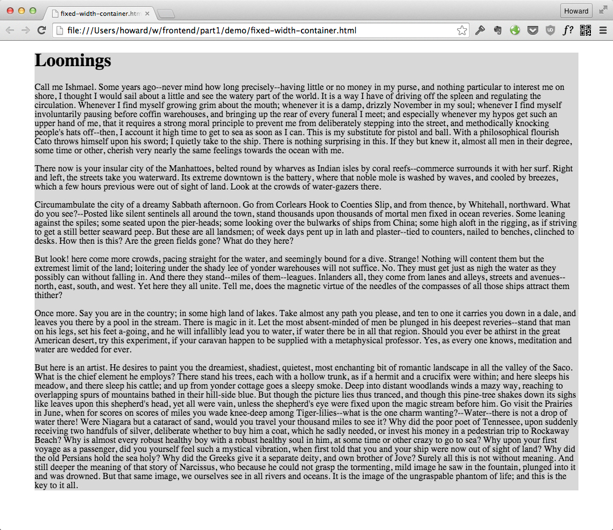

* HTML:
  ```html
  <body>
    <div class="container">
      <!-- element1 -->
      <!-- element2 -->
      <!-- element... -->
    </div>
  </body>
  ```

* CSS:
  ```css
  .container {
    width: 960px;
    margin: 0 auto;
  }
  ```

实现原理：

+ `width: 960px;` 设置外包围框的宽度。
+ `margin: 0 auto;` 让浏览器自动计算左右 margin，使外包围框居中。
  + 这个居中技巧只限于有设置宽度的容器。

你常常会看到网页选择 960px 这个宽度，这是因为一般浏览器是 1024 宽，加上滚动条就是 1000-1004。960 给滚动条和其他浏览器 UI 预留了足够的空间。
并且 960 这个数字可以 2，3，4，5，6，8，10，12 等数字除尽，方便做网格。

### 练习 - 居中外包围框

把内容加上居中外包围框。实现效果为：

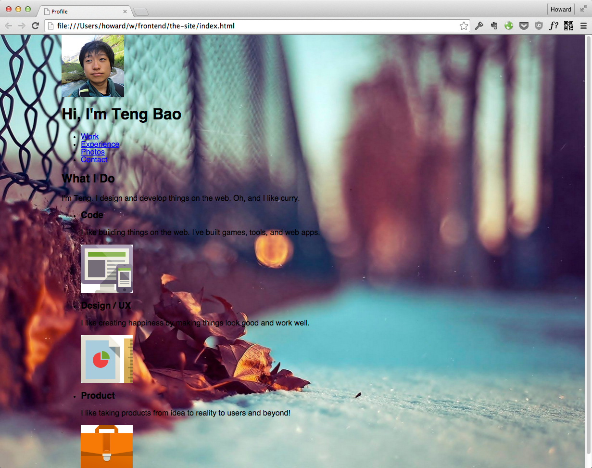

# 头部容器

这个页面中的头像有两个特点，一个是在容器中居中，一个是向上移出头部容器。

首先我们实现 header 部分。header 包含的内容为：

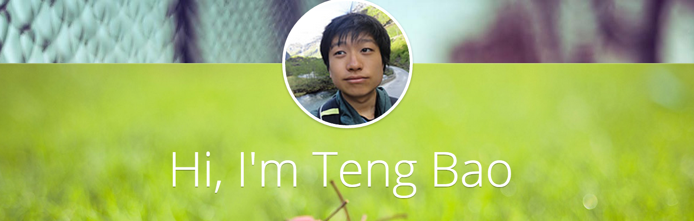

不同显示类型的 HTML 元素需要使用不同的居中技巧。HTML 元素可以简单地分为两大类。

1. [块级元素](https://developer.mozilla.org/zh-CN/docs/Web/HTML/Block-level_elements) -
  + p, div, h1, h2, table, ol 等等
2. [行元素](https://developer.mozilla.org/zh-CN/docs/Web/HTML/Inline_elemente) - 在文字流里面显示，浏览器不会添加断行。默认宽度刚好适应内容。
  + span, img, a, button, input 等等

我们来看看浏览器怎么渲染这两种不同类型的元素：

* 灰色背景是块级元素。浏览器会在块级元素前后增加断行。这些元素的默认宽度会填满父容器。

* 红色背景是行元素，他们的宽度刚好适应内容，而且不会造成断行。

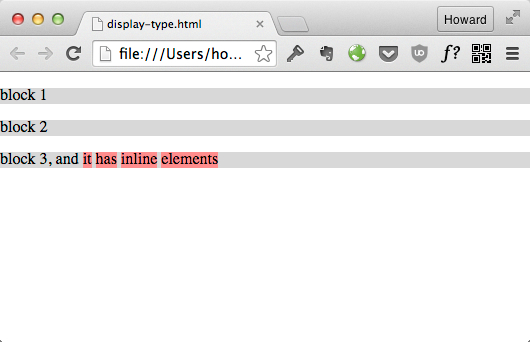

我们现在就来看看怎么居中这两种元素。

### CSS 技巧 - 居中元素

+ HTML:
  ```html
  <!-- This is an image, with display set to 'block' in CSS.
       Centered by setting left/right margin.to auto.
  -->
  

  <div class="centered-container">
    <!-- All inline elements are centered in this container. -->
    <h1>Moby Dick</h1>
    
  </div>
  ```

+ CSS:

  ```css
  .centered-image {
    display: block;
    width: 25%;
    margin: 0 auto;
  }

  .centered-container {
    text-align: center;
  }
  ```

[居中元素 Demo](demo/horizontal-centering.html)

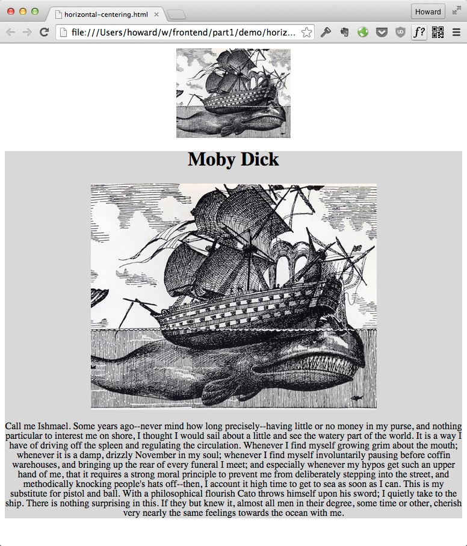

实现原理：

+ `display: block;` 把行元素变成块元素
+ `margin: 0 auto;` 居中块元素
  + 元素一定要有 `width` 属性
+ `text-align: center;` 通过容器来居中行元素

使用 `text-align` 居中必须经过一个元素的父元素来居中，这会影响在这个容器里所有的元素。
在前面这个例子你可以看到不只是图片居中了, h1 和 p 里面的文字也被居中了。

如果你想要居中一个行元素（比如图片），但不影响同个容器里面的其他元素，那你可以选择把它设定为块元素来居中。

### 练习 - 实现头部容器

**1. 布局：**

+ 设定头部容器的背景
  + `background-image: url(../img/banner.jpg);`
+ 居中头像和 h1 标题。把头像的 img 元素设定为块元素

**2. 字体风格：**

+ 引用 [Google Fonts](https://www.google.com/fonts#UsePlace:use/Collection:Open+Sans) 提供的 Open Sans 字体
```
<link href='http://fonts.googleapis.com/css?family=Open+Sans:400,300' rel='stylesheet' type='text/css'>
```
在中国 Google Fonts 可以引用 [360 前端公共库](http://libs.useso.com/)提供的镜像。
```
<link href='http://fonts.useso.com/css?family=Open+Sans:400,300' rel='stylesheet' type='text/css'>
```

+ 调整 字体 属性
```css
font-weight: 300;
font-size: 50px;
font-family: 'Open Sans','helvetica',arial,sans-serif;
text-shadow: 0 1px rgba(0,0,0,0.3);
```

**3. 头像修饰**

+ 给头像加阴影
  + `box-shadow: 0 0px 2px 1px rgba(0,0,0,0.2);`
+ 把头像变成圆形
  + `border-radius: 999px`


成果看起来这样的：

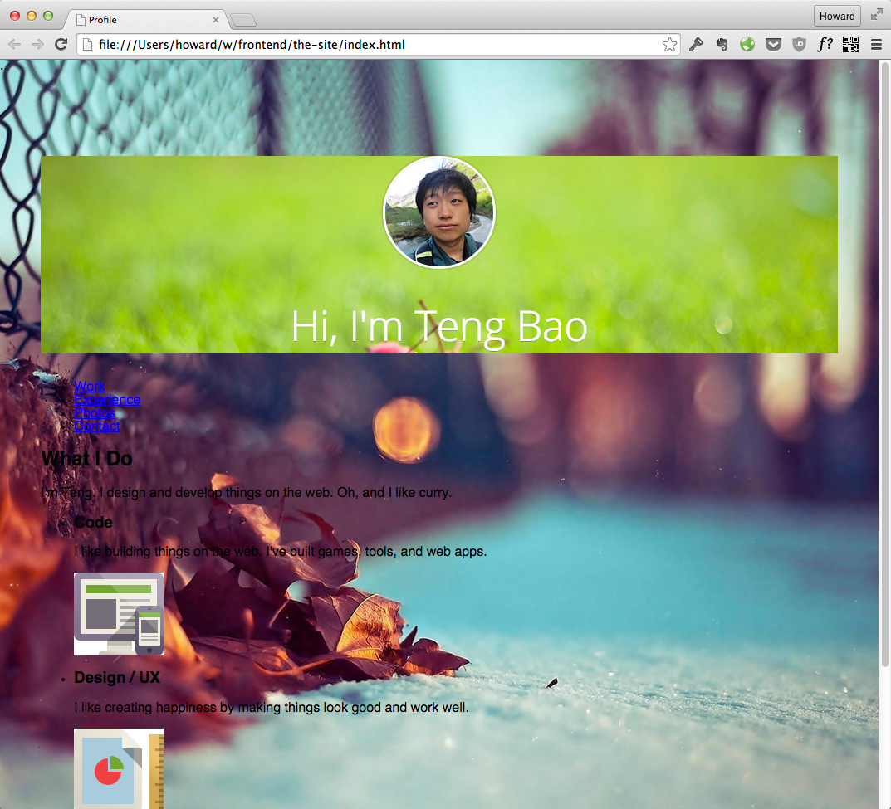

# 调整元素间距

虽然我们头部容器的元素已经居中了，它们的位置还是不太对。

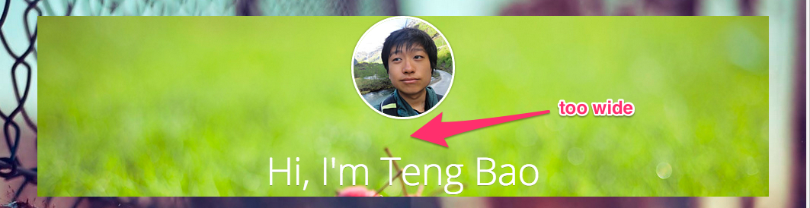

### CSS 技巧 - 用 margin 调整间距

我们要用 margin 来指定元素之间的间距。在这个例子我们让一个容器里的每个元素之间有 50px 的间距。元素和容器也有 50px 的间距。

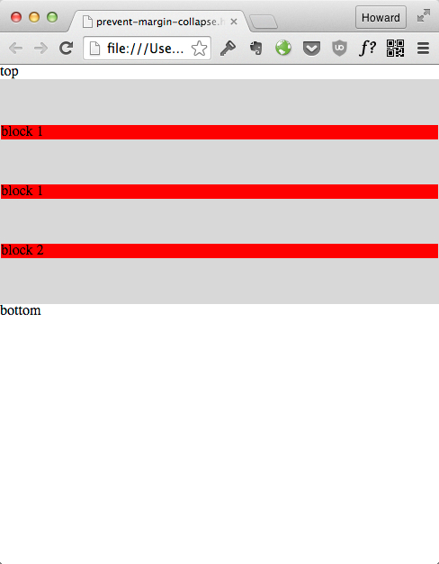

[Demo 用 margin 调整间距](demo/prevent-margin-collapse.html)

+ HTML:
  ```html
  <div class='container'>
    <p>block 1</p>
    <p>block 1</p>
    <p>block 2</p>
  </div>
  ```

+ CSS:
  ```css
  .container {
    background-color: #D8D8D8;
    padding: 1px;
  }

  .container p {
    margin-top: 50px;
    margin-bottom: 50px;
  }
  ```

+ `margin-top: 50px;` 和 `margin-bottom: 50px;` 设定间距
+ `padding: 1px;` 禁止 .container 折叠间距

在 .container 上面加上的 `padding: 1px;` 有点神奇。假如我们没有加上这个 `padding: 1px;`，你会发现效果变成了这样：

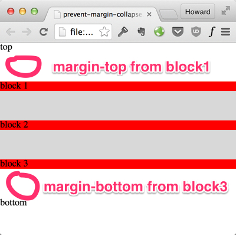

这是因为容器本身的 margin-top 会和第一个子元素的 margin-top 折叠在一起。在容器和 `top` 这个字符之间的空白其实是 子元素的 margin-top。同样的，父元素的 margin-bottom 会和最后一个子元素的 margin-bottom 也折叠一起了。

有关 margin 折叠的细节和用法可以看 [
Collapsing Margins](http://www.sitepoint.com/web-foundations/collapsing-margins/)

### 练习 - 调整头部容器里头像和标题的间距

1. 头像
  + 用 `margin-top: -70px;` 把它往上调
  + `margin-bottom: 10px;`

2. 标题
  + `margin-bottom: 20px;`

实现后的效果应该是这样：

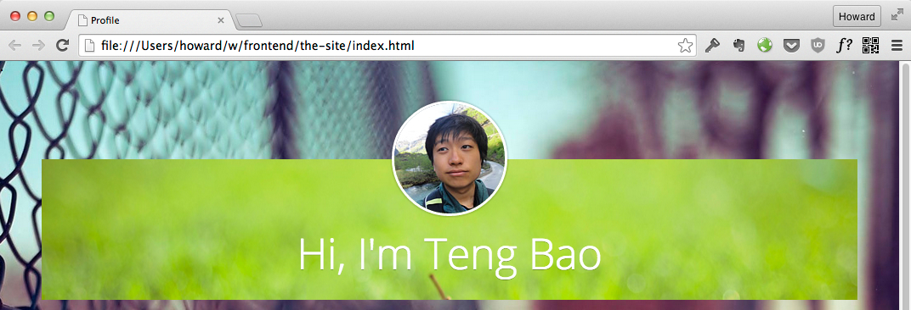

提示：如果你的头像凸不出容器, 效果有下面这个错误：

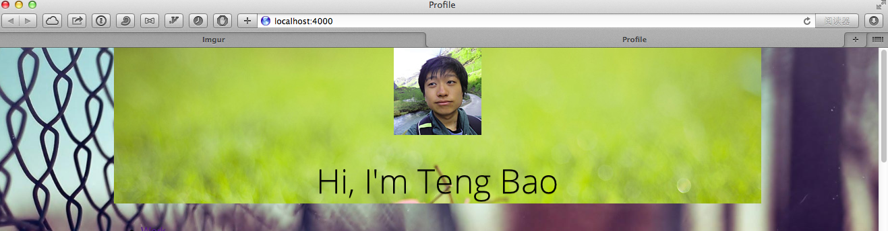

怎么修复？请再回想一下 `margin 折叠` 的问题。

# 怎样排序 CSS 属性

在开发前端的过程 CSS 属性可能会越积越多。如果只是随机排序，一眼看上去很难理解它的布局。比如：

```css
.main-header__avatar {
  border-radius: 999px;
  border: 3px solid white;
  margin: 0 auto;
  display: block;
  margin-top: -70px;
  box-shadow: 0 0px 2px 1px rgba(0,0,0,0.2);
}
```

如果我们把定位还有盒模型相关的属性放前面，看起来会清晰很多：

```css
.main-header__avatar {
  display: block;
  margin: 0 auto;
  margin-top: -70px;
  border: 3px solid white;

  border-radius: 999px;
  box-shadow: 0 0px 2px 1px rgba(0,0,0,0.2);
}
```

具体的属性排序可以按照以下的规则：

1. 定位属性: position, float, z-index, clear
2. 盒模型相关属性: padding, margin, display, width, height, border
3. 字体相关
4. CSS2 视觉相关属性 (background)
5. CSS3 属性 (border-radius, box-shadow)

详情请看 [CSS property order - @mdo](http://markdotto.com/2011/11/29/css-property-order/)

### 练习 - 重新排序你的 CSS 属性

# Part 1 - 总结

在这个课程的 Part 1 你学会了如何使用 CSS 设计模型来实现一些简单的页面布局：

+ 实现固定的背景
+ 实现一个居中容器，包围所有内容
+ 横向居中的两个技巧
+ 用 margin 调整间隔。如何解决 margin collapse 的问题

接下来在 Part 2 我们会来继续用 CSS 设计模型来实现这个页面的其他设计元素：

+ 实现导航
  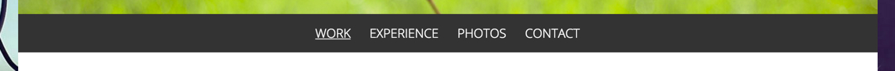
+ 同等宽度的内容块
  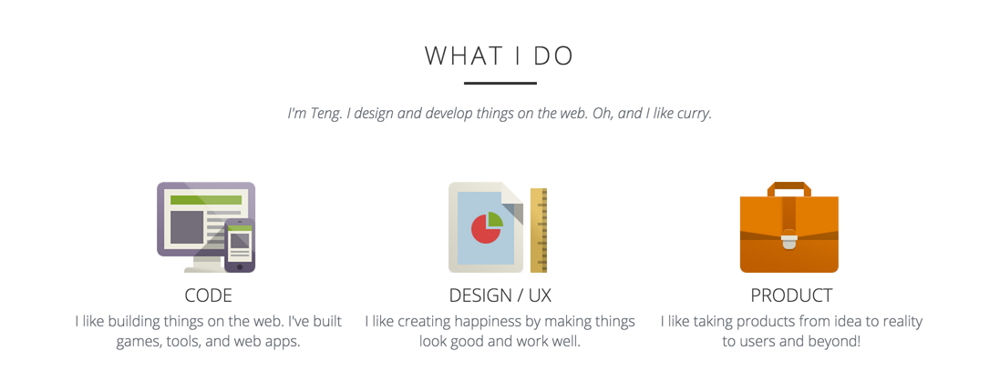

