# 实现导航和页面内容

这节课我们的任务是完成导航和第一个内容块的布局。在这个过程我们会来了解

+ 怎么依照语义编写 HTML
+ 怎么用 float 来做布局

# 设置全局字体风格

开始之前，我们来调整一下全局的字体：

```css
body {
  font-family: 'Open Sans','helvetica',arial,sans-serif;
  font-weight: 300;
  color: #62686f;
}

h1, h2, h3, h4, h5, h6 {
  color: #333;
  font-weight: 300;
}
```

在下面的练习，我们会按需在各个模块调整字体属性。

# 导航布局的实现思路

接下来我们要做出这个效果：


1. 4 个链接在同一行显示；
2. 4 个链接的内容居中显示。

挺简单的。套用第一节课介绍的居中方法，我们可以这么做：

1. 把每个链接变成 inline 元素
2. 把容器设定为 `text-align: center`

# 混淆语义和样式

有了实现思路，就可以开始写代码啦！这时候新手常常会犯一个错误，在编写 HTML 的时候以样式为出发点来决定用什么元素:

+ 导航容器是个块元素，那用 `div` 啦~
+ 链接应该是行元素，那用 `span` 就可以啦~
+ 链接要用大写，那就用大写呗~

```html
<div class="nav">
  <span class="nav__item"><a href="#">WORK</a></span>
  <span class="nav__item"><a href="#">EXPERIENCE</a></span>
  <span class="nav__item"><a href="#">PHOTOS</a></span>
  <span class="nav__item"><a href="#">CONTACT</a></span>
</div>
```

Naive！


# HTML 语义

在编写 HTML 的时候我们需要先了解模块在页面中的职能（即语义），然后依据各个模块的职能来选择合适的元素：

1. 导航模块应该使用 `nav`
2. 文章模块就应该使用 `article`
3. 头部模块应该使用 `header`
4. 无编号列表模块应该使用 `ul`

HTML5 引入了一系列的语义标签，如 header, footer, article, section, nav, 等等。

在编写主导航的时候我们应该这么分析：

+ 主导航这个容器应该用 nav
+ 容器里面有个列表，用 ul
+ 每个链接放在个别的条目 li 里面

主导航的 HTML：

```html
<nav class="main-nav">
  <ul>
    <li><a href="#">Work</a></li>
    <li><a href="#">Experience</a></li>
    <li><a href="#">Photos</a></li>
    <li><a href="#">Contact</a></li>
  </ul>
</nav>
```

注意，虽然设计里链接的文字都是全大写的，我们编写的 HTML 它们应该是用常规的写法。这是因为 “全大写” 是样式范畴，而非文本语义的范畴。

你可能觉得这边用 div 还是用 nav 没什么差别，但用了 ul 好像更麻烦了一点。列表的默认风格是这样的：


我们需要:

+ 消除列表本身的默认间隔
+ 消除列表条目的默认风格
+ 把列表条目编程行元素

为什么要这么蛋疼？遵照 HTML 语义有什么好处呢？

1. 分离内容和页面的表现方法。

  假如我们要把导航改成垂直的菜单，不需要去修改 HTML 把 span 变成 div
2. 看到一个 nav 就知道是导航，不需要去看它的风格。方便和别的前端工程师协作。

对于模块语义的理解不同人会不一样，比如导航内的 4 个链接并不一定非要认为是一个无编号列表，也可以简单地将他们看做 4 个 `a` 标签的堆叠，从而对应的代码为：

```html
<nav class="main-nav">
  <a href="#">Work</a>
  <a href="#">Experience</a>
  <a href="#">Photos</a>
  <a href="#">Contact</a>
</nav>
```

但总体上使用的标签不能和语义本身偏离太多。语义 HTML 就好像代码缩进，虽然对页面实现来说没有太大的差别，但不用的结果会令人看起来浑身不舒服。

总结我们上面说说的，在实现页面中的一个模块的时候我们可以分成以下几个步骤：

1. 了解模块在页面中的职能（语义）；
2. 编写 HTML 代码；
3. 观察模块的布局特点；
4. 编写 CSS 代码。

### HTML5 语义标签的浏览器支持

+ [Can I Use: Semantic Elements](http://caniuse.com/#search=semantic)

IE8 虽然不支持，但我们引用的 normalize.css [解决了这个问题](https://github.com/necolas/normalize.css/blob/2bdda84272650aedfb45d8abe11a6d177933a803/normalize.css#L33-L60)。

Dive Into HTML5 有对 [语义 HTML 深入的介绍](http://diveintohtml5.info/semantics.html)。

# 实现主导航

我们现在就来来实现导航的风格。


1. 4 个链接在同一行显示；
2. 4 个链接的内容居中显示。

每当你有一系列相关的模块，你通常会把它们放在一个列表里面。通常我们需要去覆盖列表的默认风格。这是一个很常见的技巧。

Bootstrap 很多组件都是这样实现的。比如：

[分页](http://getbootstrap.com/components/#pagination-default)

```html
<ul class="pagination">
  <li>
    <a href="#" aria-label="Previous">
      <span aria-hidden="true">&laquo;</span>
    </a>
  </li>
  <li><a href="#">1</a></li>
  <li><a href="#">2</a></li>
  <li><a href="#">3</a></li>
  <li><a href="#">4</a></li>
  <li><a href="#">5</a></li>
  <li>
    <a href="#" aria-label="Next">
      <span aria-hidden="true">&raquo;</span>
    </a>
  </li>
</ul>
```

[面包屑](http://getbootstrap.com/components/#breadcrumbs)

```html
<ol class="breadcrumb">
  <li><a href="#">Home</a></li>
  <li><a href="#">Library</a></li>
  <li class="active">Data</li>
</ol>
```

[垂直菜单](http://getbootstrap.com/components/#dropdowns)

```html
<ul class="dropdown-menu" role="menu" aria-labelledby="dropdownMenu1">
  <li role="presentation"><a role="menuitem" tabindex="-1" href="#">Action</a></li>
  <li role="presentation"><a role="menuitem" tabindex="-1" href="#">Another action</a></li>
  <li role="presentation"><a role="menuitem" tabindex="-1" href="#">Something else here</a></li>
  <li role="presentation"><a role="menuitem" tabindex="-1" href="#">Separated link</a></li>
</ul>
```

### CSS 设计模式 - 去除列表的风格

[去除列表的风格 Demo](demo/override-lists.html)

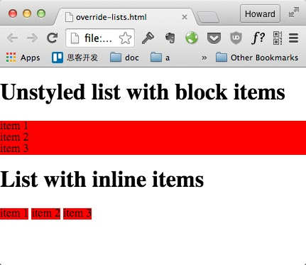

**HTML**:

```html
<h1>Unstyled list with block items</h1>

<ul class="nostyle">
  <li>item 1</li>
  <li>item 2</li>
  <li>item 3</li>
</ul>

<h1>List with inline items</h1>

<ul class="nostyle inline-items">
  <li>item 1</li>
  <li>item 2</li>
  <li>item 3</li>
</ul>
```

**CSS**:

```css
ul.nostyle {
  list-style: none;
  padding: 0;
  margin: 0;
}

ul.inline-items li {
  display: inline;
}
```

**实现原理**：

+ `list-style: none;` 把列表装饰去掉
+ `padding: 0; margin: 0;` 把浏览器默认的间隔清除

`li` 默认是块元素。需要元素在同行显示的话记得把它们变成行元素:

+ `display: inline`

### 练习 - 实现主导航

我们把比较繁琐的的设计风格写好了，布局就看你的啦！

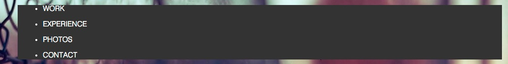

```css
.main-nav {
  background-color: #333;
}

.main-nav ul li {
  margin: 15px 10px;
}

.main-nav ul li a {
  color: #fff;
  font-size: 0.9rem;
  font-weight: 300;
  text-transform: uppercase;
  text-decoration: none;
}

.main-nav ul li a:hover {
  text-decoration: underline;
}
```

实现的过程中你可能会发现左右边距变化了，而上下边距不生效：

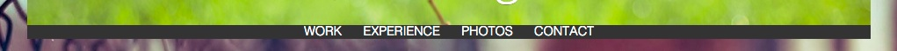

这是因为 inline 元素只能设置其左右内边距和外边距，而不能设置其高度和上下内外边距。和垂直高度有关的 padding, margin, height 都无效。

这时可以使用 `display: inline-block`。`inline-block` 元素可以简单理解为对外表现为行元素，而对内表现为块元素。

+ 上下 padding, margin 有效
+ 容器的 text-align 会对它居中

结果：


# 准备 "What I Do" 小节

我们现在开始来实现第一个内容小节：

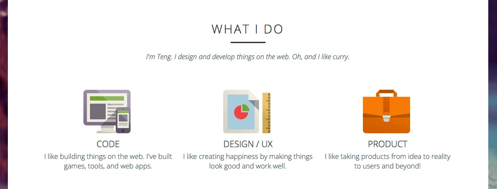

这部分的 HTML 如下：

```html
<section class="info-section whatido">
  <header>
    <h2>What I Do</h2>
    <p class="info-section__description">I'm Teng. I design and develop things on the web. Oh, and I like curry.</p>
  </header>
  <ul class="whatido__skill-list">
    <li>
      <h3>Code</h3>
      <p>I like building things on the web. I've built games, tools, and web apps.</p>
    </li>
    <li>
      <h3>Design / UX</h3>
      <p>I like creating happiness by making things look good and work well.</p>
    </li>
    <li>
      <h3>Product</h3>
      <p>I like taking products from idea to reality to users and beyond!</p>
    </li>
  </ul>
</section>
```

有两点值得注意：

1. `What I Do` 标题下面没有用 hr 或其他元素来显示下划线
2. 没有用 img 元素来显示这三个技能的图片

和内容无关的装饰性设计元素应该通过 CSS 来实现。下面的练习我们会把图片和下划线加上去。

我们把 `.info-section` 加上白色背景，这样我们才看得清内容：

```css
.info-section {
  background-color: #fff;
}
```

你会发现 nav 和 info-section 之间有个神奇的空隙：

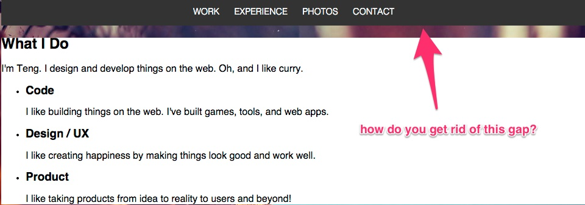

**练习**： 初步处理 `.info-section` 的小问题。

1. 修复 nav 和 info-section 之间的空隙

  提示: 回想一下第一课提到的 Margin Collapse 问题。

2. 把 `whatido__skill-list` 的列表风格去除


结果应该是：

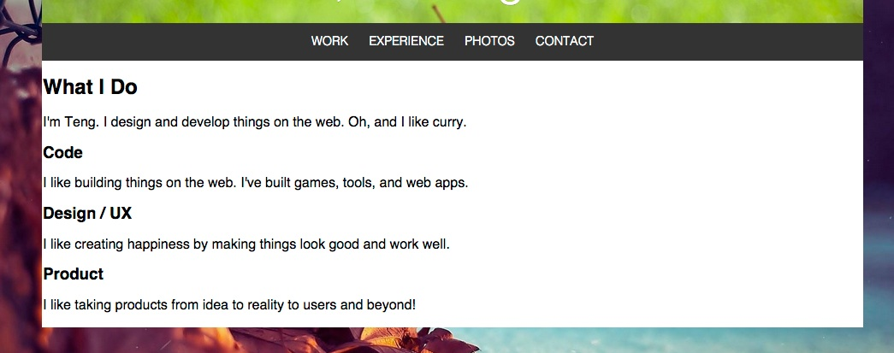

# 为每个技能配图

通常一个萝卜一个坑，每个元素在文档流会占据一定的空间，一个接着一个。但有时候有些元素不在文档流里面，比如：

1. 定位的元素 （fixed 或者 absolute 定位）
2. CSS 背景图

为了完整地显示这些不在文档流的东西，我们可以用 padding 在一个容器里预留空间。

### CSS 设计模型 - 给文档流以外的东西留空间

在这个示范我们用 CSS 背景给头部容器加上一个鲸鱼商标。

[给文档流以外的东西留空间 Demo](demo/padding-reserve-space.html)

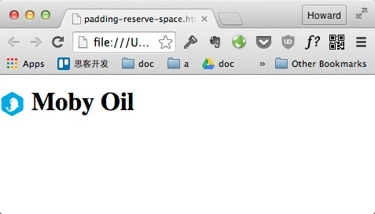

**HTML:**

```html
<header>
  <h1>Moby Oil</h1>
</header>
```

**CSS:**

```css
header {
  /* logo design by Alex Leroy Deval */
  /* see: https://dribbble.com/shots/833445-Whale-logo-WIP */
  background-image: url("whale-logo.png");
  background-repeat: no-repeat;
  background-size: contain;
  padding-left: 40px;
}
```

实现原理:

+ `padding-left: 40px` 通常图片的的大小是固定的。左边预留的空间写死就可以了。

### 练习：为每个技能配图

我们可以用 background 来配图，并居中图片：

```css
.whatido__skill--code {
  background-image: url(../img/skill-code.png);
}

.whatido__skill--design {
  background-image: url(../img/skill-design.png);
}

.whatido__skill--product {
  background-image: url(../img/skill-product.png);
}
```

+ 禁止背景图重复
  + `background-repeat: no-repeat;`
+ 居中背景图
  + `background-position: center top;`
+ 元素内部要有足够的空间完整地显示背景图

成果：

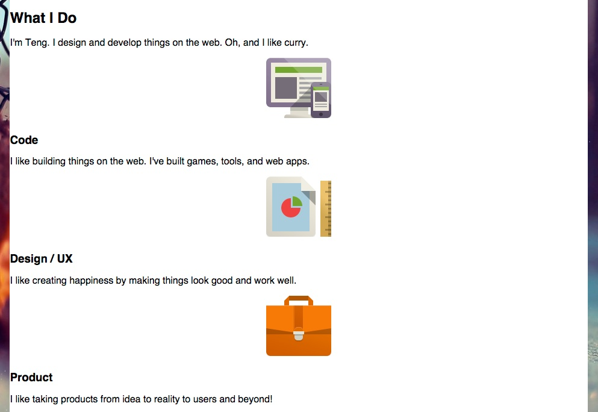

# 三个技能的布局

实现这个效果我们只需要把父容器的宽度平均分配给三个同宽的元素即可，也就是说每个元素个占 33.3% 的宽度。

### CSS 设计模型 - 用 Float 布局来占满父容器的宽度

在这个示范我们用三个元素把父容器的宽度完全占满。中间的元素使用 60% 的空间，两边个占 20%。

[Float 布局 Demo](demo/layout-with-floats.html)

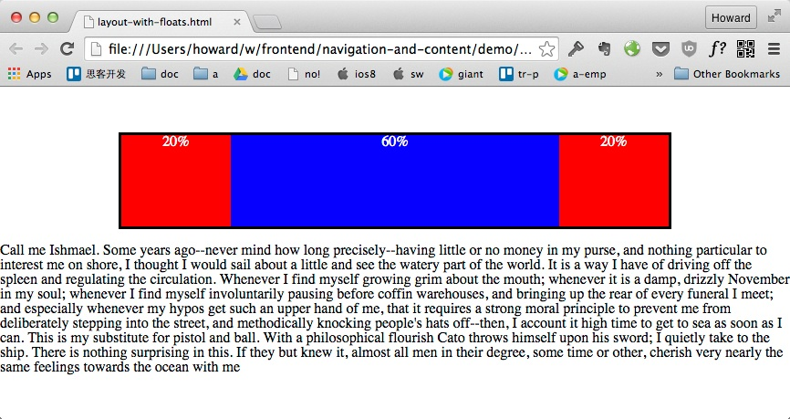

**HTML**:

```html
<div class="container float-layout">
  <div class="child child--20">20%</div>
  <div class="child child--60">60%</div>
  <div class="child child--20">20%</div>
</div>
```

**CSS**:

```css
.float-layout {
  overflow: hidden;
}

.float-layout .child {
  float: left;
}

.child--20 {
  width: 20%;
}

.child--60 {
  width: 60%;
}
```

**实现原理**：

+ `width: 20%`, `width: 60%` 指定子元素的宽度。
+ `float: left` 让子元素向左飘动。

这个技巧使用了 float。float 的排版和不同行元素和块元素的排版是完全不一样的机制。关于 float 的科普知识你可以看 [All About Floats](https://css-tricks.com/all-about-floats/) 这篇文。请忽略关于 IE6 的坑。

你可能注意到了父容器的 overflow 属性。它的效用是：

+ `overflow: hidden` 强制容器有足够的高度包围飘动元素。

假如没有使用 `overflow: hidden`, 而是用了默认的 `overflow: visible`，我们会得到这个效果：

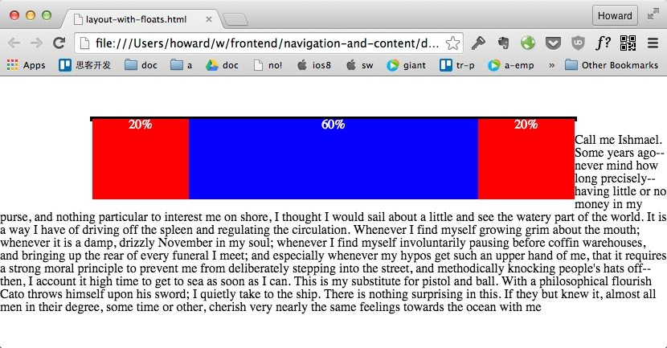

这个效果可以分成几个步骤来理解：

1. 容器高度为 0
2. 飘动元素由容器凸出来
3. 下面的文字在飘动元素右边显示，按照 float 的排版机制

所以问题的出发点在于容器高度为 0。

你可能会觉得 `overflow: hidden` 这个技巧非常不直观。下面我们解释它的原理。没兴趣的话你可以直接跳到练习。

* * *

容器在计算自身高度的时候必须要有足够的高度包围所有的子元素。但 float 的元素 （还有绝对定位的元素）并不包含在这个计算里面。这个行为依照 [CSS2.1 10.6.3](http://www.w3.org/TR/2011/REC-CSS2-20110607/visudet.html#normal-block) 的算法。

`overflow: hidden` 做的改变是让容器 float 元素包含在高度计算，依照 [CSS2.1 10.6.7](http://www.w3.org/TR/2011/REC-CSS2-20110607/visudet.html#root-height) 的算法。

为啥变成 `overflow: hidden` 容器就愿意把飘动元素算在自己的高度里面呢？为什么默认高度算法么奇怪，不把飘动元素计算进去？

这是因为 float 的设计是为了方便图文排版，之后才拿来做 UI 布局。最经典的 float 用法是让一张飘动的图跨越两个文字块：


默认的 `overflow: visible` 等于是说 “我允许容器里面的内容凸出这个容器”，所以在这个使用场景飘动的图片凸出了容器，并不包含在容器的高度里面。

而 `overflow: hidden` 是说 “我不允许容器里面的内容凸出这个容器”。在这种情况针对 CSS 有两个方案可以选择：

1. 把飘动图片截断
2. 把容器扩大到足够的高，包围图片

CSS 选择了 2 这个方案。


### 练习 - 布局三个技能块

+ 用 float 来布局技能块
+ 给 .info-section 加上 padding。
  ```css
  .info-section {
    padding: 30px 60px;
  }
  ```
+ 居中标题
+ 加上字体风格
  ```css
  .info-section header h2 {
    font-size: 28px;
    text-transform: uppercase;
    letter-spacing: 3px;
  }

  .info-section__description {
    font-style: italic;
  }
  ```
+ 调整标题和内容的边距为 60px

  

  这个边距可以放在三个地方都可以达到相同的效果：

  1. `whatido__skill-list` 的 margin-top
  2. `.info-section header` 的 margin-bottom
  3. `.info-section header h2` 的 margin-bottom

  貌似随便选一个都没差。这时候你应该观察在页面其他地方是什么样子，再决定 CSS 怎么写才能重复利用•

成果：

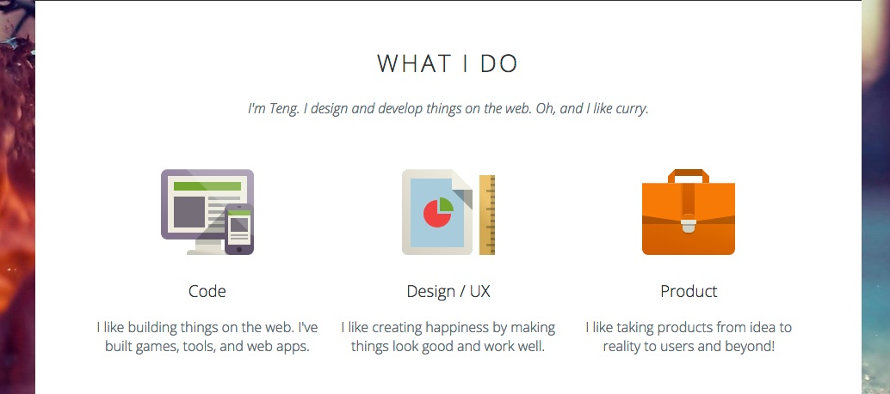

# 再说 float 布局 - clearfix

上个小节我们看到了用 Float 布局的时候容器高度为 0 的问题：


这个问题有另外一个常见的解决方案 clearfix。

### CSS 设计模型 - 用 clear 撑高容器

[用 clearfix 撑高容器 Demo](demo/clearfix.html)


**HTML:**

```html
<div class="container float-layout clearfix">
  <div class="child child--20">20%</div>
  <div class="child child--60">60%</div>
  <div class="child child--20">20%</div>
</div>
```

**CSS:**

```css
.clearfix:after {
  content:"";
  display:table;
  clear:both;
}
```

**实现原理**：

+ `content:""` 在 clearfix 这个元素内部最后加上一个空的伪元素该元素与 `.child` 类并列
+ `clear:both` 使伪元素清除飘动元素
+ notice:这里 `display:table` 是为了处理 `margin collapse` ，参考这篇[文章](http://nicolasgallagher.com/micro-clearfix-hack/)，至于后面的标题装饰也会使用到这个技巧，不过那里就不要用 `display:table` 了，应该使用 `display:block`

我们之前说过，容器的高度之所以会是 0 是因为飘动元素不包括在容器高度的计算里面。想要撑高容器的话，我们可以在飘动元素后面加上一个普通元素：

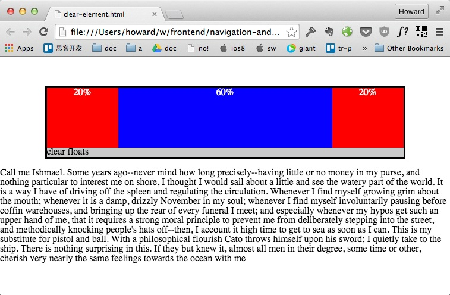

clearfix 利用 :after 伪元素创建了一个看不到的元素。

clearfix 和之前介绍的 `overflow: hidden` 效果一模一样，但背后的原理其实不一样。你在实现的时候可以按情况选一个方便的来使用。

关于 clearfix 的科普请看：[The very latest new new way to do "clearfix"](http://www.cssmojo.com/latest_new_clearfix_so_far/)

### 练习 - 去掉 overflow 属性，改用 clearfix

# 为何不用 Inline Block 做布局

说了这么多关于飘动元素的问题，反正只是让元素往左靠拢，为啥不用 inline-block 就好了？

原因是因为行元素 （inline 和 inline-block） 是为了显示文字用的。 如果在书写 HTML 文件时行元素之间有空白符，这些空白会显现出来。

[行元素之间的空白 Demo](demo/float-vs-inline.html)

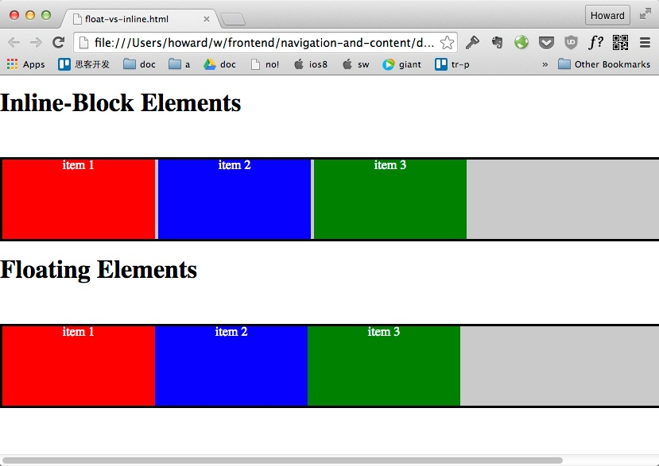

+ 如果你的布局对空白不敏感 （比如我们之前实现的导航），那么你可以选用 inline-block
+ 对空白敏感的布局 （分栏，grid）请用 float

# 标题装饰

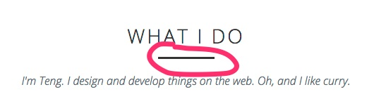

标题下面的下划线装饰属于样式范畴，而非文本语义的范畴。与其在 HTML 加个没有意义的 hr 元素，请用 `:after` 伪元素创建这个下划线。

### 练习 - 为标题加上下划线

+ 用 `border-bottom: 3px solid black` 来划线
