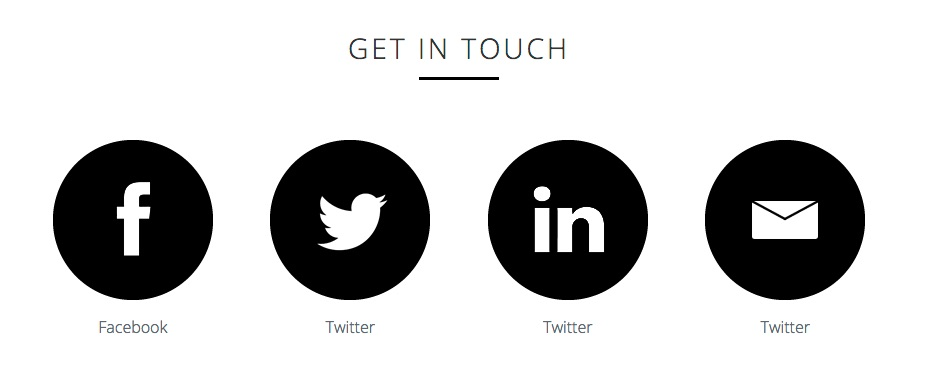
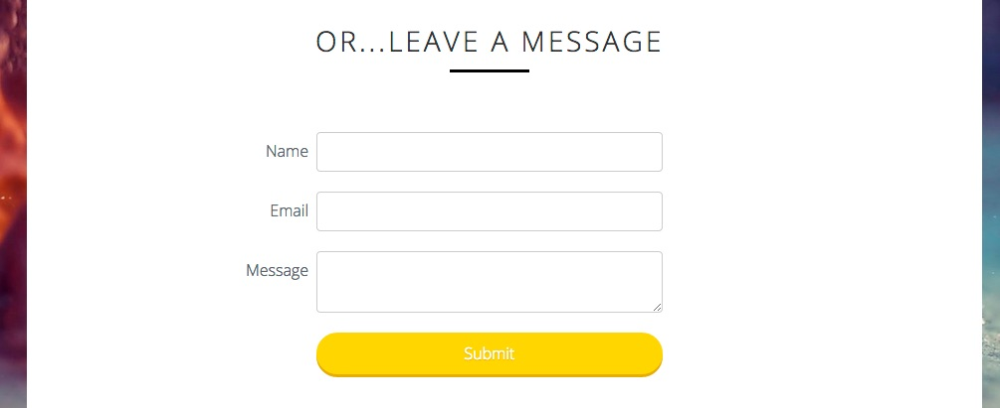
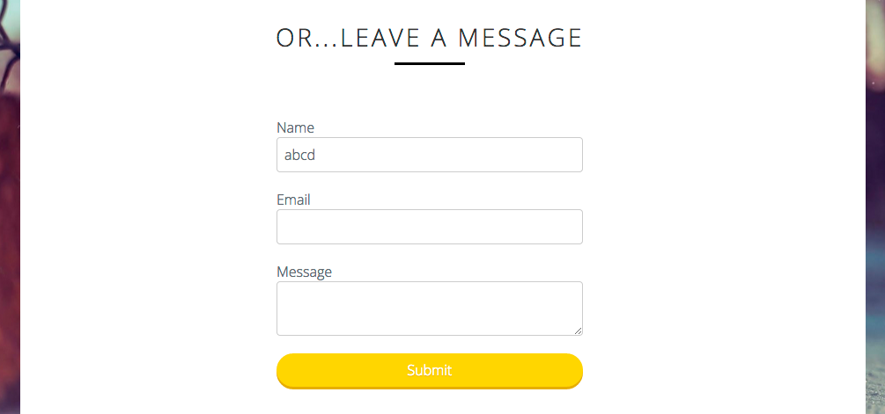
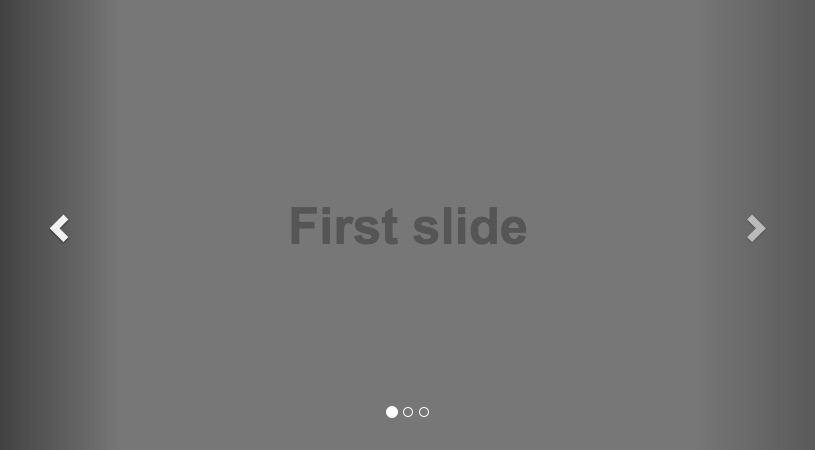
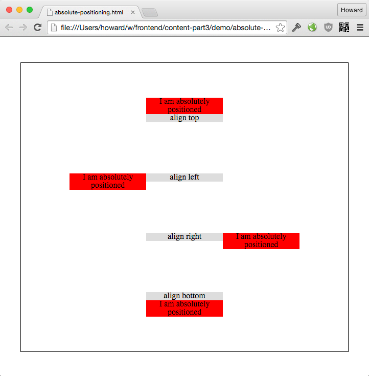
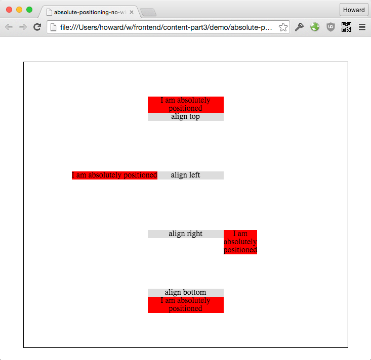

# 实现页面内容 - Part 3

# 实现 Get In Touch

有了前面的练习，这个布局应该很容易就实现了。请你自己做。

### 练习 - 实现 Get In Touch

成果



# 实现 Leave A Message

接下来我们来分析 "Leave A Message" 表单的布局：



1. 输入栏和 submit 按钮居中
2. Name, Email, Message 这些标签在表单容器外面，向右靠齐

### 练习 - 初步实现表单的布局和风格

和之前一样，我们把没啥技术含量的修饰性风格准备好了:

```css
.contact input,
.contact textarea {
  border: 1px solid #ccc;
  border-radius: 4px;
}

.contact button {
  border: none;
  border-radius: 9999px;

  background: #ffd524;

  cursor: pointer;
  text-shadow: 0 1px 1px rgba(0,0,0,0.2);
  color: #fff;
  box-shadow: 0 3px 0 #daae1d;
}
```

加上了上面这些风格，你的出发点应该是这样：


请布局表单：

+ 表单的宽度为容器的 40%
+ 输入栏的 padding 为 8px



# 使用绝对定位

输入栏标签的布局是使用绝对定位 (`position: absolute`) 的一个经典场景。绝对定位的的适用情况大概是

1. 有一个主要组件，在文件流里面正常布局；
2. 这个组件有一个附属组件 (它的小伙伴)；
3. 这个附属组件的位置相对于主要组件的位置。

以我们这个表单举例，输入栏是正常布局，而标签的位置在输入栏的左边，用绝对定位移过去。我们来看看其他一些实用例子.

**菜单**：


+ 按钮是正常布局的主要组件
+ 菜单附属在按钮上面，用绝对定位

**工具提示**：


**在容器里位置固定的组件**:




### CSS 设计模型 - 把子元素移到外面，和容器的边靠齐

[把子元素移到外面 Demo](demo/absolute-positioning.html)



**HTML:**

```html
<div class="box">
  align top
  <div class="align-top">
    I am absolutely positioned
  </div>
</div>

<div class="box">
  align left
  <div class="align-left">
    I am absolutely positioned
  </div>
</div>

<div class="box">
  align right
  <div class="align-right">
    I am absolutely positioned
  </div>
</div>

<div class="box">
  align bottom
  <div class="align-bottom">
    I am absolutely positioned
  </div>
</div>
```

**CSS**:

```css
.box {
  position: relative;
}

.align-bottom {
  position: absolute;
  top: 100%;
  width: 100%;
}

.align-left {
  position: absolute;
  top: 0;
  left: -100%;
  width: 100%;
}

.align-right {
  position: absolute;
  top: 0;
  left: 100%;
  width: 100%;
}

.align-top {
  position: absolute;
  bottom: 100%;
  width: 100%;
}
```

+ `.box { position: relative; }`
  + 父容器的定位不能是默认的 'static'
+ `top: 100%`, `left: 100%`
  + 这里的百分比（%）是相对于父容器高和宽的百分比
+ `width: 100%`
  + 指定元素的宽度为父容器的宽度

使用绝对定位也有一些奇怪的坑。如果你不为定位的元素设定宽度的属性，浏览器会依照 left 和 right 和容器的宽度来自动计算该元素的宽度。[具体计算方式](http://dev.w3.org/csswg/css-position/#abs-non-replaced-width)比较复杂，我们这里就只示范一下如果没有给定位元素加上 width 的话会是什么奇葩效果：


[绝对定位自动计算出来的奇葩宽度 Demo](demo/absolute-positioning-no-width.html)



你可以看到两个改变：

+ `.align-left` 的绝对定位元素的宽度足够长显示所有的内容, 而不断行。
+ `.align-right` 的这个绝对定位元素为了用最短的宽度显示内容，在每个字之间断行了...

为什么一个用最适合的宽度，令一个用最短的宽度？设计成这样其实是有个理由的。。。我们这里就不纠结了。你只要记得给绝对定位元素加上宽度就可以避免奇怪的坑。

大多数场景你预先就能知道绝对定位元素的宽高。如果绝对定位的容器的宽高会因为它的内容而变化，这种情况通常会需要用 JavaScript 来测量容器的实际宽高，然后调整位置。

### 练习 - 把输入栏标签移到左边去

+ 做绝对定位时记得把父元素设置为 `position: relative`
+ 标签和输入栏内容应该对齐

结果：


# 总结

前面几堂课我们学了 CSS 布局的一些基础：

+ block 和 inline-block 的区别
+ float 布局的方法和坑
+ absolute 定位的用法

回顾这个布局，你会发现除了图片和外围容器，我们没有写死任何容器的宽高。基本上页面上的元素都会自动适应它们的容器宽度。这些实现的细节会让响应式设计的实现相对容易！

