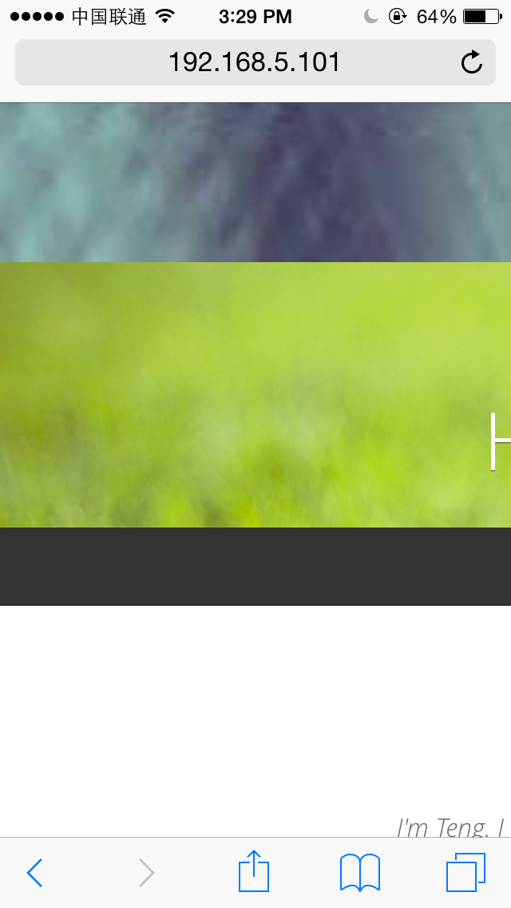
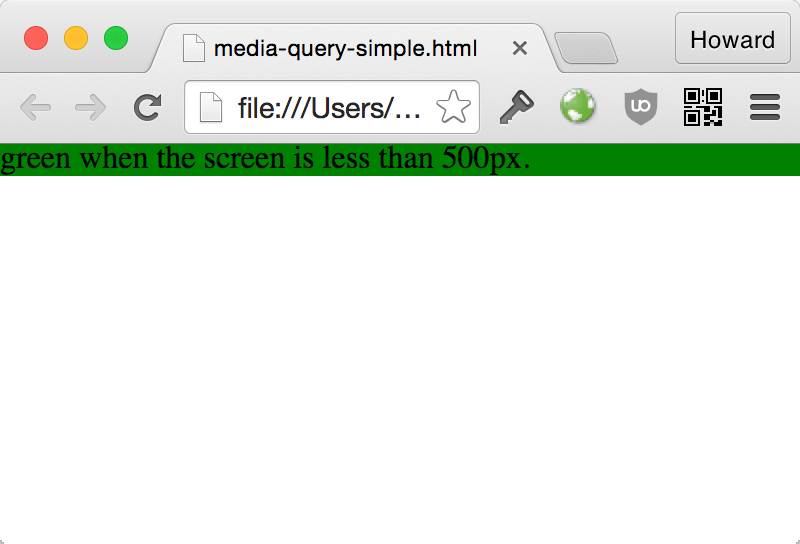
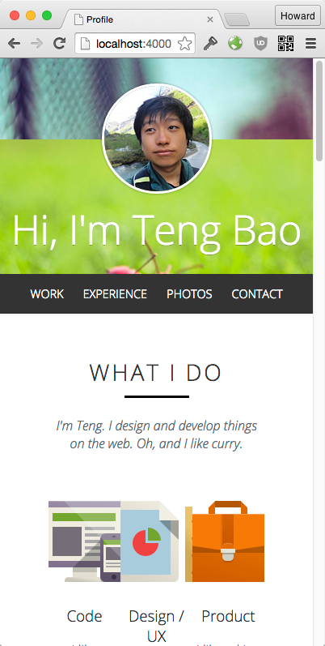
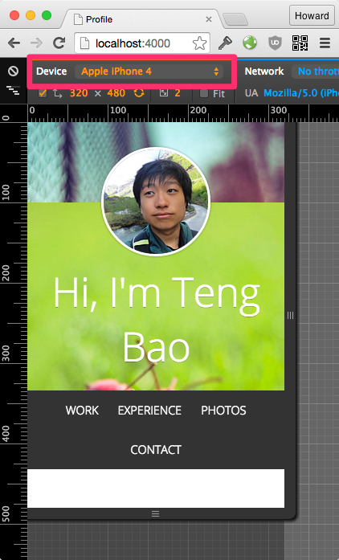
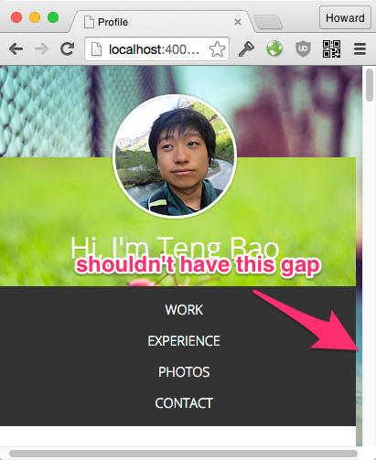
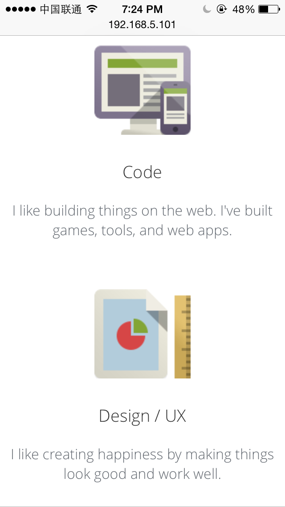

# 响应页面的实现

现在通过移动设备上网的用户越来越多，同时也使得一个网站的访客使用的分辨率五花八门。可能是一台 27 寸的显示器、可能是一个笔记本电脑、可能是一部 iPhone 6 手机，也可能是一个 PSP，甚至有可能是一块手表。

在以前分辨率种类不多的情况下，我们可以为移动设备单独定制移动版来解决手机方法网页的问题。然后如今如此多的分辨率的情况下，专门的移动版显得并不经济。事实上有很多网站在开发支出就有“兼容手机和平板电脑”这样的需求，这也是“响应式网页布局（Responsive Web Layouts）”出现的原因。

所谓响应式布局，即网页会对用户浏览器的分辨率（的变化）进行响应，包括调整元素的尺寸、修改页面布局以及隐藏某些元素等等。

# 在手机上测试

在命令行运行 `browser-sync` 我们可以看到下面这些输出

```
> browser-sync start --server --port 4000 --files index.html --files css/main.css
[BS] Access URLs:
 --------------------------------------
       Local: http://localhost:4000
    External: http://192.168.5.101:4000
```

在手机浏览器打开 `External: http://192.168.5.101:4000` 就可以 Live 编辑页面啦~

（具体 URL 可能因为你本地网路而不一样）

# 设置页面缩放方式

移动浏览器默认显示网页的策略是将网页缩放以使得整个页面可以在浏览器中全部显示出来。而既然要做移动端适配，自然不希望页面被缩放使得文字变小，这样我们可以设置 viewport 的 `initial-scale` 属性为 1 来禁止缩放。我们 HTML 模板中包含了下面这个 meta 标签：

```html
<meta name="viewport" content="width=device-width, initial-scale=1">
```

没有它的话在手机上看起来是这样的：


加上了标签后就不会缩放了：



由于页面过大，只有左上角的一小区域显示了出来。

# 调整外围容器宽度

我们在第一课的时候说过，使用一个外围容器有两个好处：

1. 容器里块元素的宽度默认是外围容器的宽度
2. 调整外围容器就会调整所有内部元素的宽度

所以，只要为移动端调整外围容器的宽度，我们就可以有初步的 ”响应“。

### CSS 技巧 - 使用 Media Query

media query 可以限制 CSS 的有效条件，如 “只有当屏幕宽度在 100px 到 200px 之间才生效”、“只在手机横屏时生效” 等等。通过 media query 我们可以实现为不同的页面宽度应用不同的样式。media query 是响应式布局的基础。

现在来示范一个例子，在不同的浏览器宽度让一个容器有不同的背景色。

[Media Query Demo](demo/media-query-simple.html)

500px 以下:



500px 以上:


**HTML**:

```html
<div class="change-color">
  green when the screen is less than 500px.
</div>
```

**CSS**:

```css
.change-color {
  background: red;
}

@media (max-width : 500px) {
  .change-color {
    background: green;
  }
}
```

+ `(max-width : 500px)`
  + 这些 CSS 只适用于 500px 以下的屏幕宽度

江湖上你常会看到 media query 这么写:

```css
@media only screen (max-width : 500px) {

}
```

这里添加的条件 `only screen` 限制这些 CSS 只对屏幕生效。打印页面的时候这些风格不会生效。

没有 media query 的 CSS 默认对所有媒体形式生效。如果你需要支持屏幕和打印，你可以在引用 CSS 文件的时候加上 media 属性。

```html
<link rel="stylesheet" href="css/main.css" media="screen">
<link rel="stylesheet" href="css/print.css" media="print">
```

查看 Media Query 的兼容性：

+ [Can I Use: Media Query](http://caniuse.com/#feat=css-mediaqueries)

IE9 才开始有支持。IE6-8 需要引用这个 JavaScript 的 polyfill：[Respond.js](https://github.com/scottjehl/Respond)

### 练习 - 调整容器大小

现在的页面

我们应该在那个那个宽度加上 media query 呢？

如果窗口不够宽完整地显示外围容器，让外围容器自动适应窗口的宽度。

+ 960px 以下的屏幕设定外围容器的宽度为 100%

效果：



# 为那些尺寸做响应？

不要针对任何设备的尺寸来做响应。我们可以参照 bootstrap 设定的四种尺寸：


```css
/* Large Devices, Wide Screens */
@media only screen and (max-width : 1200px) {

}

/* Medium Devices, Desktops */
@media only screen and (max-width : 992px) {

}

/* Small Devices, Tablets */
@media only screen and (max-width : 768px) {

}

/* Extra Small Devices, Phones */
@media only screen and (max-width : 480px) {

}
```

在做设计的时候就要为这些宽度范围考虑好，布局如何、有哪些元素不重要可以隐藏等等。

在这个课程我们用 480px 为一个分水岭，480px 以上当做是桌面，480px 一下做移动端的布局。480px-960px 之间的宽度我们就不管了，你之后可以当做练习。

# 修改 header 和导航

用 Chrome Inspector 模拟 iPhone4，是这样的情况：



+ 导航区域不够长
+ 标题字体太大

### 练习 - 修改标题字体

+ 标题的字体是 `font-size: 32px`

结果：


### 练习 - 修改导航区域

+ 导航的每个链接都改成 block

有个坑请注意：



提示：`.main-nav li` 的 margin 泄露出去了

成果：


# 修改 What I Do

### 练习

+ `.info-section` padding 减少为 10px
+ `li.whatido__skill` margin-bottom 增加为 40px

成果：



# 修改 Experience and Education

### 练习

+ img 宽度保持为 180px， 居中


# 标题断行问题

在狭窄的窗口 `Education & Experience` 这个标题断行地特别难看：


无法忍，怎么办？

### 练习 - 解决标题断行问题

把标题的排版改成这样 (只限于移动端)：

```
Education
    &
Experience
```

达成这个目标，我们在模板里面加上一个 span:

```html
<h2>Education <span>&amp;</span> Experience</h2>
```

成果：


# 修改 Photos

### 练习

成果：


# 修改 Get In Touch

### 练习

提示：不需要使用 padding 或者 margin。

成果：


# 修改 Leave A Message

### 练习

+ label 变回默认的 `position: static`

成果：


# Mobile-first vs Desktop-first

在这个课程我们以桌面为出发点，用了 `max-width` 的 media query 为移动端的布局打补丁。

很多人在做响应式设计喜欢以移动端为出发点，再用 `min-width` 的 media query 为平板和左面的布局打补丁。`min-width` 指定的 CSS 只有在某个窗口宽度以上才会生效，和我们这个课程用的 media-query 恰恰相反。

Mobile-first 的实现思路由简单到复杂，做起来可能比较直观。可以看看这篇博文的介绍：[How To Write Mobile-First CSS](http://www.zell-weekeat.com/how-to-write-mobile-first-css/)

# 总结

使用 media query 只是响应式实现的第一步。移动端的特殊环境不只是屏幕小，还有延迟长，带宽小的问题。

其他针对移动端优化的贴心小技巧可以读这篇文：

[Creating a Mobile-First Responsive Web Design](http://www.html5rocks.com/en/mobile/responsivedesign/)
